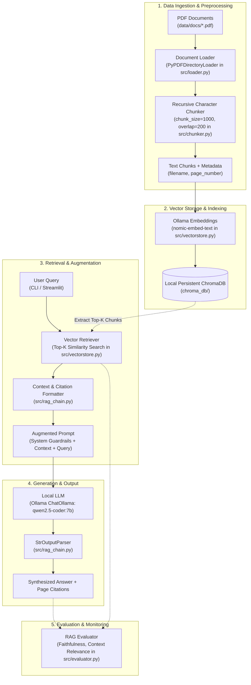

# RAG Pipeline Architecture Document

## 1. System Overview

This project is a privacy-first, 100% local **Retrieval-Augmented Generation (RAG)** pipeline designed to ingest, index, and query local PDF documents without sending data or telemetry outside the local machine. It combines **LangChain**, **Ollama**, and **ChromaDB** with an interactive **Streamlit** user interface and a unified CLI.

---

## 2. End-to-End Architecture Diagram



---

## 3. Core Component Breakdown

### 3.1 Retrieval Component
- **Loader (`src/loader.py`)**: Uses `PyPDFDirectoryLoader` and `PyPDFLoader` to parse multi-page PDFs. It attaches normalized metadata (`filename` and 1-indexed `page_number`) to each document.
- **Chunker (`src/chunker.py`)**: Employs `RecursiveCharacterTextSplitter` configured with `chunk_size=1000` characters and `chunk_overlap=200` characters. This ensures semantic continuity across chunk boundaries while preserving metadata.
- **Embeddings & Vector Store (`src/vectorstore.py`)**: Interacts with the local Ollama daemon via `OllamaEmbeddings(model="nomic-embed-text")` (embedding dimension 768, 8k context). Vectors and document chunks are persisted to disk in `chroma_db/`. Retrieval uses cosine/L2 vector similarity with a default of $k=4$.

### 3.2 Augmentation Component
- **Context Construction (`src/rag_chain.py`)**: Retrieved chunks are serialized into tagged context blocks:
  ```
  [Chunk i | Source: <filename>, Page: <page_number>]
  <chunk content>
  ```
- **Prompt Engineering**: The system prompt enforces strict anti-hallucination guardrails:
  - Answers must rely strictly on the provided context.
  - If information is missing, the model must explicitly respond with: *"I cannot find the answer to that in the provided documents."*

### 3.3 Generation Component
- **Inference Engine (`src/rag_chain.py`)**: Uses `ChatOllama` running the `qwen2.5-coder:7b` instruction-tuned model locally at low temperature ($T=0.2$) for deterministic, factual outputs.
- **Citation Extraction**: Formulates structured citations listing the document name, page number, and relevant text snippet for each source chunk.

### 3.4 Evaluation Component
- **Metric Suite (`src/evaluator.py`)**:
  - **Context Relevance**: Measures whether retrieved chunks match query intent.
  - **Answer Faithfulness**: Validates whether facts mentioned in the generated answer are grounded in the retrieved chunks.
  - **Citation Precision**: Ensures every citation points to an actual retrieved chunk.

### 3.5 Presentation & Access
- **Web UI (`app.py`)**: Streamlit application running on `http://localhost:8501`. Provides file upload, one-click indexing, chat history, and collapsible citation cards.
- **CLI (`main.py`)**: Command-line interface with `ingest`, `query <question>`, and interactive terminal `chat`.

---

## 4. Hardware & Configuration Requirements

| Dependency | Configuration | Notes |
| :--- | :--- | :--- |
| **Python** | 3.12+ (isolated in `.venv`) | Uses native packages: `langchain`, `langchain-chroma`, `streamlit` |
| **Ollama Host** | `http://localhost:11434` | Needs local daemon active |
| **Embedding Model** | `nomic-embed-text` | ~274 MB VRAM/RAM footprint |
| **LLM Model** | `qwen2.5-coder:7b` | ~4.7 GB VRAM (fallback: CPU quantized) |
| **Vector DB** | ChromaDB 1.5.9 | Embedded SQLite + HNSW index |

