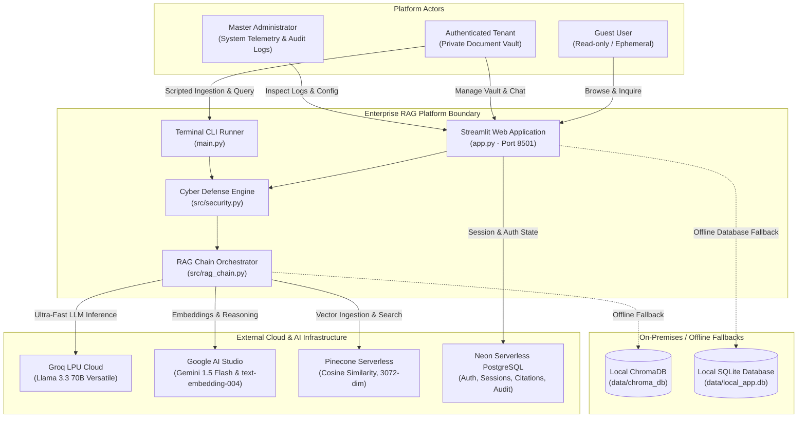
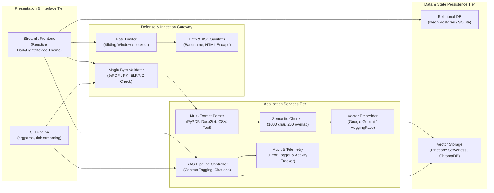
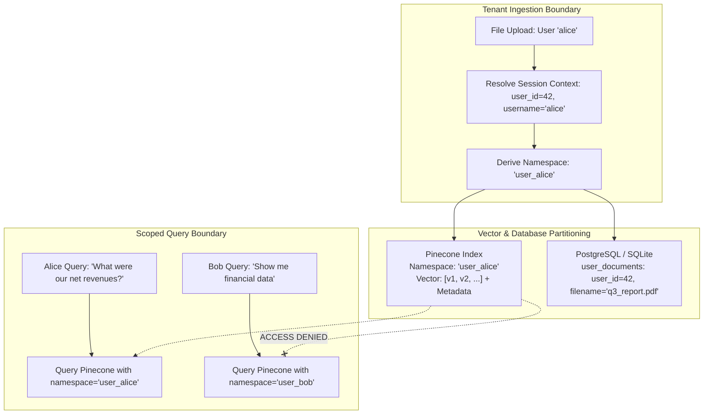
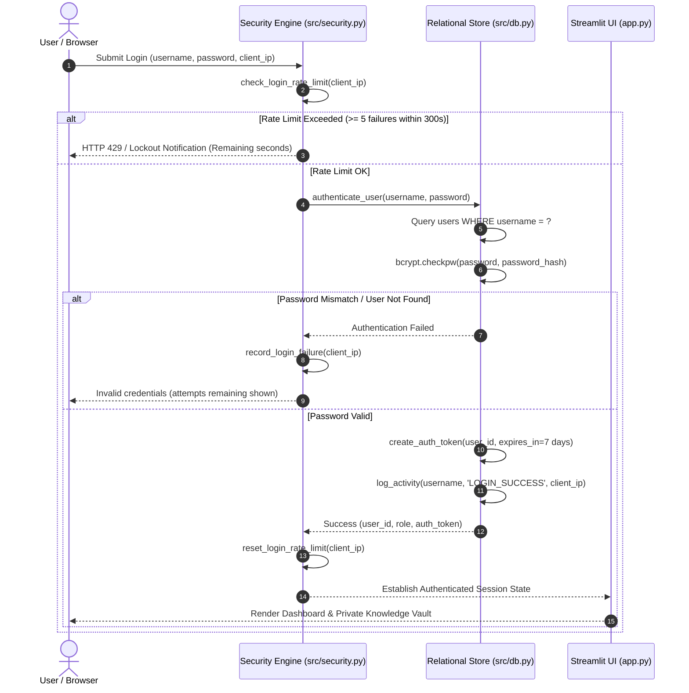
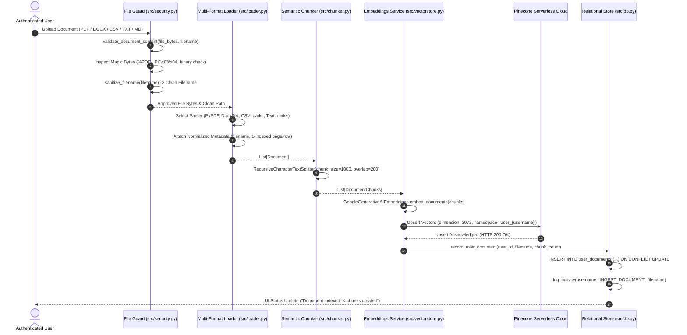
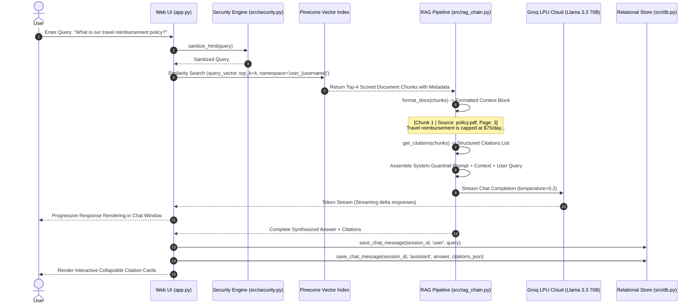
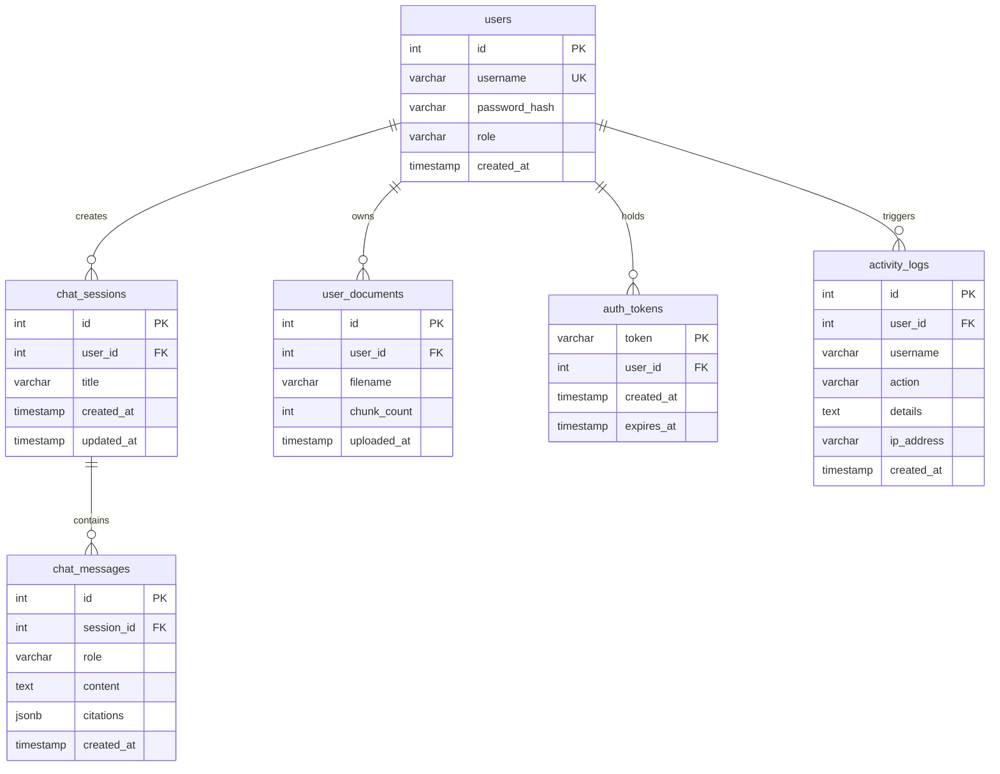

# Advanced System Architecture Specification

## Enterprise Multi-Tenant Document Intelligence Platform

---

## 1. Executive Summary & Architectural Goals

The **Enterprise Document Intelligence & Conversational RAG Platform** provides high-throughput, context-grounded conversational intelligence over heterogeneous documents (PDF, DOCX, CSV, TXT, MD). Built on a hybrid cloud-accelerated architecture, the platform enables multi-tenant document isolation, low-latency token streaming, zero-trust cybersecurity defenses, and enterprise session persistence.

### Key Architectural Tenets

1. **Multi-Tenant Vault Isolation**: Strict tenant segregation at both the relational level (foreign keys and session bounds) and vector level (Pinecone dedicated namespaces `user_{username}`), preventing cross-tenant data leakage.
2. **Dual-Engine Vector Infrastructure**: Hybrid vector retrieval pairing cloud **Pinecone Serverless** (AWS `us-east-1`, sub-50ms cosine similarity search) with an embedded **ChromaDB** local fallback (HNSW index on SQLite) for disconnected environments.
3. **Hardware-Accelerated Inference**: Millisecond token streaming powered by **Groq LPU** inference chips running `llama-3.3-70b-versatile` (~300 tokens/sec), paired with **Google Gemini** multimodal models (`gemini-1.5-flash` / `text-embedding-004`).
4. **Resilient Session State & Persistence**: Cloud **Neon Serverless PostgreSQL** paired with local **SQLite** fallback, maintaining cryptographically secure UUID tokens that survive page refreshes and browser disconnects.
5. **Zero-Trust Cyber Defense**: Multi-layered defensive perimeter comprising magic-byte file header inspection, path traversal neutralization, sliding-window brute-force rate limiters, entity-encoded XSS sanitization, and parameterized SQL execution.
6. **Adaptive, Reactive Presentation**: Responsive Streamlit client featuring a zero-lag transparent collapsed sidebar rail, theme-reactive SVG iconography, docked footer attachment tray, and mobile-first touch optimization.

---

## 2. High-Level System Architecture & C4 Model

### 2.1 C4 Level 1: System Context Diagram


```mermaid
flowchart TD
    subgraph Users["Platform Actors"]
        Guest["Guest User\n(Read-only / Ephemeral)"]
        Member["Authenticated Tenant\n(Private Document Vault)"]
        Admin["Master Administrator\n(System Telemetry & Audit Logs)"]
    end

    subgraph Platform["Enterprise RAG Platform Boundary"]
        App["Streamlit Web Application\n(app.py - Port 8501)"]
        CLI["Terminal CLI Runner\n(main.py)"]
        SecGuard["Cyber Defense Engine\n(src/security.py)"]
        Orchestrator["RAG Chain Orchestrator\n(src/rag_chain.py)"]
    end

    subgraph CloudServices["External Cloud & AI Infrastructure"]
        GroqCloud["Groq LPU Cloud\n(Llama 3.3 70B Versatile)"]
        GeminiCloud["Google AI Studio\n(Gemini 1.5 Flash & text-embedding-004)"]
        PineconeCloud["Pinecone Serverless\n(Cosine Similarity, 3072-dim)"]
        NeonDB["Neon Serverless PostgreSQL\n(Auth, Sessions, Citations, Audit)"]
    end

    subgraph LocalFallbacks["On-Premises / Offline Fallbacks"]
        ChromaLocal[("Local ChromaDB\n(data/chroma_db)")]
        SQLiteLocal[("Local SQLite Database\n(data/local_app.db)")]
    end

    Guest -->|Browse & Inquire| App
    Member -->|Manage Vault & Chat| App
    Admin -->|Inspect Logs & Config| App
    Member -->|Scripted Ingestion & Query| CLI

    App --> SecGuard
    CLI --> SecGuard
    SecGuard --> Orchestrator

    Orchestrator -->|Vector Ingestion & Search| PineconeCloud
    Orchestrator -.->|Offline Fallback| ChromaLocal
    Orchestrator -->|Ultra-Fast LLM Inference| GroqCloud
    Orchestrator -->|Embeddings & Reasoning| GeminiCloud

    App -->|Session & Auth State| NeonDB
    App -.->|Offline Database Fallback| SQLiteLocal
```

---

### 2.2 C4 Level 2: Container Architecture


```mermaid
flowchart LR
    subgraph Presentation["Presentation & Interface Tier"]
        UI["Streamlit Frontend\n(Reactive Dark/Light/Device Theme)"]
        Console["CLI Engine\n(argparse, rich streaming)"]
    end

    subgraph SecurityTier["Defense & Ingestion Gateway"]
        RateLimit["Rate Limiter\n(Sliding Window / Lockout)"]
        HeaderInspect["Magic-Byte Validator\n(%PDF-, PK, ELF/MZ Check)"]
        Sanitize["Path & XSS Sanitizer\n(Basename, HTML Escape)"]
    end

    subgraph CoreServices["Application Services Tier"]
        DocLoader["Multi-Format Parser\n(PyPDF, Docx2txt, CSV, Text)"]
        TextSplitter["Semantic Chunker\n(1000 char, 200 overlap)"]
        EmbedService["Vector Embedder\n(Google Gemini / HuggingFace)"]
        ChainService["RAG Pipeline Controller\n(Context Tagging, Citations)"]
        AuditService["Audit & Telemetry\n(Error Logger & Activity Tracker)"]
    end

    subgraph DataStorage["Data & State Persistence Tier"]
        Relational["Relational DB\n(Neon Postgres / SQLite)"]
        VectorDB["Vector Storage\n(Pinecone Serverless / ChromaDB)"]
    end

    UI --> RateLimit
    UI --> HeaderInspect
    Console --> HeaderInspect
    RateLimit --> Sanitize
    HeaderInspect --> DocLoader
    DocLoader --> TextSplitter
    TextSplitter --> EmbedService
    EmbedService --> VectorDB
    UI --> ChainService
    Console --> ChainService
    ChainService --> VectorDB
    ChainService --> AuditService
    UI --> Relational
```

---

## 3. Multi-Tenant Security & Vault Isolation Model

Data privacy and complete tenant isolation are enforced across all layers of the platform:


```mermaid
flowchart TD
    subgraph IngestionBoundary["Tenant Ingestion Boundary"]
        Upload["File Upload: User 'alice'"] --> AuthCtx["Resolve Session Context: user_id=42, username='alice'"]
        AuthCtx --> NamespaceGen["Derive Namespace: 'user_alice'"]
    end

    subgraph StorageIsolation["Vector & Database Partitioning"]
        NamespaceGen --> PineconeUpsert["Pinecone Index\nNamespace: 'user_alice'\nVector: [v1, v2, ...] + Metadata"]
        NamespaceGen --> SQLUpsert["PostgreSQL / SQLite\nuser_documents: user_id=42, filename='q3_report.pdf'"]
    end

    subgraph RetrievalIsolation["Scoped Query Boundary"]
        AliceQuery["Alice Query: 'What were our net revenues?'"] --> ScopeRetriever["Query Pinecone with namespace='user_alice'"]
        BobQuery["Bob Query: 'Show me financial data'"] --> BobRetriever["Query Pinecone with namespace='user_bob'"]
    end

    PineconeUpsert -.-> ScopeRetriever
    PineconeUpsert -.-x|ACCESS DENIED| BobRetriever
```

### Isolation Guarantees

1. **Vector Space Partitioning**: Every vector upserted to Pinecone includes an explicit `namespace="user_{username}"`. Pinecone indexes enforce hardware-level physical or logical separation between namespaces. Similarity searches executed by `alice` strictly target `namespace="user_alice"`, preventing any vector overlap with `bob`.
2. **Relational Database Row-Level Bounds**: All chat sessions, messages, and uploaded document records are bound to `user_id` foreign keys with `ON DELETE CASCADE`. All SQL select queries filter by `user_id`.
3. **Deterministic Namespace Sanitization**: Usernames are strictly validated with `^[a-zA-Z0-9_@.-]+$` and normalized, ensuring that namespaces cannot be spoofed through delimiter injection or wildcard attacks.
4. **Persistent Tokenized Authentication**: Browser sessions issue cryptographically secure random 64-character hexadecimal tokens (`secrets.token_hex(32)`) mapped to user accounts in the `auth_tokens` table. Expired tokens are purged periodically, and tokens are invalidated upon explicit logout.

---

## 4. End-to-End Sequence Diagrams

### 4.1 User Authentication & Rate Limiting Sequence


```mermaid
sequenceDiagram
    autonumber
    actor Client as User / Browser
    participant Sec as Security Engine (src/security.py)
    participant DB as Relational Store (src/db.py)
    participant UI as Streamlit UI (app.py)

    Client->>Sec: Submit Login (username, password, client_ip)
    Sec->>Sec: check_login_rate_limit(client_ip)
    alt Rate Limit Exceeded (>= 5 failures within 300s)
        Sec-->>Client: HTTP 429 / Lockout Notification (Remaining seconds)
    else Rate Limit OK
        Sec->>DB: authenticate_user(username, password)
        DB->>DB: Query users WHERE username = ?
        DB->>DB: bcrypt.checkpw(password, password_hash)
        alt Password Mismatch / User Not Found
            DB-->>Sec: Authentication Failed
            Sec->>Sec: record_login_failure(client_ip)
            Sec-->>Client: Invalid credentials (attempts remaining shown)
        else Password Valid
            DB->>DB: create_auth_token(user_id, expires_in=7 days)
            DB->>DB: log_activity(username, 'LOGIN_SUCCESS', client_ip)
            DB-->>Sec: Success (user_id, role, auth_token)
            Sec->>Sec: reset_login_rate_limit(client_ip)
            Sec-->>UI: Establish Authenticated Session State
            UI-->>Client: Render Dashboard & Private Knowledge Vault
        end
    end
```

---

### 4.2 Multi-Format Document Ingestion & Chunking Sequence


```mermaid
sequenceDiagram
    autonumber
    actor Client as Authenticated User
    participant Sec as File Guard (src/security.py)
    participant Loader as Multi-Format Loader (src/loader.py)
    participant Chunker as Semantic Chunker (src/chunker.py)
    participant Embed as Embeddings Service (src/vectorstore.py)
    participant Pinecone as Pinecone Serverless Cloud
    participant DB as Relational Store (src/db.py)

    Client->>Sec: Upload Document (PDF / DOCX / CSV / TXT / MD)
    Sec->>Sec: validate_document_content(file_bytes, filename)
    Sec->>Sec: Inspect Magic Bytes (%PDF-, PK\x03\x04, binary check)
    Sec->>Sec: sanitize_filename(filename) -> Clean Filename
    Sec-->>Loader: Approved File Bytes & Clean Path
    Loader->>Loader: Select Parser (PyPDF, Docx2txt, CSVLoader, TextLoader)
    Loader->>Loader: Attach Normalized Metadata (filename, 1-indexed page/row)
    Loader-->>Chunker: List[Document]
    Chunker->>Chunker: RecursiveCharacterTextSplitter(chunk_size=1000, overlap=200)
    Chunker-->>Embed: List[DocumentChunks]
    Embed->>Embed: GoogleGenerativeAIEmbeddings.embed_documents(chunks)
    Embed->>Pinecone: Upsert Vectors (dimension=3072, namespace='user_{username}')
    Pinecone-->>Embed: Upsert Acknowledged (HTTP 200 OK)
    Embed->>DB: record_user_document(user_id, filename, chunk_count)
    DB->>DB: INSERT INTO user_documents (...) ON CONFLICT UPDATE
    DB->>DB: log_activity(username, 'INGEST_DOCUMENT', filename)
    DB-->>Client: UI Status Update ("Document indexed: X chunks created")
```

---

### 4.3 RAG Query, Context Retrieval & Citation Synthesis Sequence


```mermaid
sequenceDiagram
    autonumber
    actor Client as User
    participant UI as Web UI (app.py)
    participant Sec as Security Engine (src/security.py)
    participant Pinecone as Pinecone Vector Index
    participant Chain as RAG Pipeline (src/rag_chain.py)
    participant Groq as Groq LPU Cloud (Llama 3.3 70B)
    participant DB as Relational Store (src/db.py)

    Client->>UI: Enter Query: "What is our travel reimbursement policy?"
    UI->>Sec: sanitize_html(query)
    Sec-->>UI: Sanitized Query
    UI->>Pinecone: Similarity Search (query_vector, top_k=4, namespace='user_{username}')
    Pinecone-->>Chain: Return Top-4 Scored Document Chunks with Metadata
    Chain->>Chain: format_docs(chunks) -> Formatted Context Block
    Note over Chain: [Chunk 1 | Source: policy.pdf, Page: 3]<br/>Travel reimbursement is capped at $75/day...
    Chain->>Chain: get_citations(chunks) -> Structured Citations List
    Chain->>Chain: Assemble System Guardrail Prompt + Context + User Query
    Chain->>Groq: Stream Chat Completion (temperature=0.2)
    Groq-->>UI: Token Stream (Streaming delta responses)
    UI-->>Client: Progressive Response Rendering in Chat Window
    Chain-->>UI: Complete Synthesized Answer + Citations
    UI->>DB: save_chat_message(session_id, 'user', query)
    UI->>DB: save_chat_message(session_id, 'assistant', answer, citations_json)
    UI-->>Client: Render Interactive Collapsible Citation Cards
```

---

## 5. Relational Database Data Model & DDL Schema

The platform supports both **Neon Serverless PostgreSQL** (production cloud) and **SQLite** (local embedded resilience).

### 5.1 Entity-Relationship Diagram (ERD)


```mermaid
erDiagram
    users ||--o{ chat_sessions : "creates"
    users ||--o{ user_documents : "owns"
    users ||--o{ auth_tokens : "holds"
    users ||--o{ activity_logs : "triggers"
    chat_sessions ||--o{ chat_messages : "contains"

    users {
        int id PK
        varchar username UK
        varchar password_hash
        varchar role
        timestamp created_at
    }

    chat_sessions {
        int id PK
        int user_id FK
        varchar title
        timestamp created_at
        timestamp updated_at
    }

    chat_messages {
        int id PK
        int session_id FK
        varchar role
        text content
        jsonb citations
        timestamp created_at
    }

    user_documents {
        int id PK
        int user_id FK
        varchar filename
        int chunk_count
        timestamp uploaded_at
    }

    auth_tokens {
        varchar token PK
        int user_id FK
        timestamp created_at
        timestamp expires_at
    }

    activity_logs {
        int id PK
        int user_id FK
        varchar username
        varchar action
        text details
        varchar ip_address
        timestamp created_at
    }
```

### 5.2 PostgreSQL DDL Specification

```sql
-- 1. User Identity & Role-Based Access Control
CREATE TABLE IF NOT EXISTS users (
    id SERIAL PRIMARY KEY,
    username VARCHAR(64) UNIQUE NOT NULL,
    password_hash VARCHAR(255) NOT NULL,
    role VARCHAR(32) DEFAULT 'user',
    created_at TIMESTAMP WITH TIME ZONE DEFAULT CURRENT_TIMESTAMP
);

-- 2. Chat Sessions (Threads)
CREATE TABLE IF NOT EXISTS chat_sessions (
    id SERIAL PRIMARY KEY,
    user_id INT REFERENCES users(id) ON DELETE CASCADE,
    title VARCHAR(255) NOT NULL,
    created_at TIMESTAMP WITH TIME ZONE DEFAULT CURRENT_TIMESTAMP,
    updated_at TIMESTAMP WITH TIME ZONE DEFAULT CURRENT_TIMESTAMP
);

-- 3. Turn-by-Turn Conversational Messages with Citations
CREATE TABLE IF NOT EXISTS chat_messages (
    id SERIAL PRIMARY KEY,
    session_id INT REFERENCES chat_sessions(id) ON DELETE CASCADE,
    role VARCHAR(32) NOT NULL,
    content TEXT NOT NULL,
    citations JSONB DEFAULT '[]'::jsonb,
    created_at TIMESTAMP WITH TIME ZONE DEFAULT CURRENT_TIMESTAMP
);

-- 4. Multi-Tenant User Document Vault Registry
CREATE TABLE IF NOT EXISTS user_documents (
    id SERIAL PRIMARY KEY,
    user_id INT REFERENCES users(id) ON DELETE CASCADE,
    filename VARCHAR(255) NOT NULL,
    chunk_count INT DEFAULT 0,
    uploaded_at TIMESTAMP WITH TIME ZONE DEFAULT CURRENT_TIMESTAMP,
    UNIQUE(user_id, filename)
);

-- 5. Persistent Authentication Tokens (Refresh Resilience)
CREATE TABLE IF NOT EXISTS auth_tokens (
    token VARCHAR(128) PRIMARY KEY,
    user_id INT REFERENCES users(id) ON DELETE CASCADE,
    created_at TIMESTAMP WITH TIME ZONE DEFAULT CURRENT_TIMESTAMP,
    expires_at TIMESTAMP WITH TIME ZONE NOT NULL
);

-- 6. Immutable Security Activity & Audit Trail
CREATE TABLE IF NOT EXISTS activity_logs (
    id SERIAL PRIMARY KEY,
    user_id INT REFERENCES users(id) ON DELETE SET NULL,
    username VARCHAR(64) NOT NULL,
    action VARCHAR(64) NOT NULL,
    details TEXT,
    ip_address VARCHAR(64) DEFAULT 'client',
    created_at TIMESTAMP WITH TIME ZONE DEFAULT CURRENT_TIMESTAMP
);

-- Indices for Performance Optimization
CREATE INDEX IF NOT EXISTS idx_chat_messages_session ON chat_messages(session_id);
CREATE INDEX IF NOT EXISTS idx_chat_sessions_user ON chat_sessions(user_id);
CREATE INDEX IF NOT EXISTS idx_user_documents_user ON user_documents(user_id);
CREATE INDEX IF NOT EXISTS idx_auth_tokens_user ON auth_tokens(user_id);
CREATE INDEX IF NOT EXISTS idx_activity_logs_created ON activity_logs(created_at DESC);
```

---

## 6. Cyber Defense & Threat Mitigation Matrix

The system integrates proactive, automated defensive mitigations targeting the **OWASP Top 10 for Large Language Model Applications** and classic web vulnerability vectors:

| Threat Category | Potential Attack Vector | Defensive Engineering Mitigation | Code Implementation |
| :--- | :--- | :--- | :--- |
| **LLM01: Prompt Injection** | Adversarial text instructions embedded in documents attempting to override system behavior | Structured prompt isolation with strict delimiters (`--- Context from Documents: ---`), system instructions instructing deterministic grounding, and zero instruction execution from context blocks. | `src/rag_chain.py` |
| **LLM06: Sensitive Info Disclosure** | User attempts to extract documents owned by another tenant | Strict namespace filtering (`namespace="user_{username}"`) in Pinecone and `WHERE user_id = ?` in relational queries. Users cannot query outside their namespace. | `src/vectorstore.py`, `src/db.py` |
| **OWASP A01: Broken Access Control** | URL tampering or forged session parameters | Cryptographically random UUID session tokens (`secrets.token_hex(32)`) checked against database with expiry verification. | `src/security.py`, `src/db.py` |
| **OWASP A02: Cryptographic Failures** | Storing plaintext or weakly hashed passwords | Adaptive `bcrypt` password hashing with automatically generated per-user salts. Plaintext passwords never enter persistence. | `src/db.py` (`hash_password`) |
| **OWASP A03: Injection (SQLi)** | Malicious SQL inputs in username, session titles, or filenames | 100% parameterized queries using DB-API placeholders (`%s` in PostgreSQL, `?` in SQLite). String interpolation is strictly forbidden. | `src/db.py` |
| **OWASP A03: Injection (XSS)** | Malicious HTML/JavaScript payloads in filenames, citations, or query results | Comprehensive HTML entity escaping (`html.escape(quote=True)`) on all user-controlled text rendered into the DOM. | `src/security.py` (`sanitize_html`) |
| **OWASP A05: Security Misconfiguration** | Disguised executable files uploaded to server (`.exe`, `.elf` disguised as `.pdf`) | Deep magic-byte binary header inspection (`%PDF-`, `PK\x03\x04`, null-byte rejection in text files). MIME spoofing is neutralized. | `src/security.py` (`validate_document_content`) |
| **Path Traversal / Directory Climbing** | Filenames containing `../`, `..\`, `/etc/passwd`, `C:\Windows` | `sanitize_filename` uses `Path(clean).name` to extract strictly the file basename, strips invalid characters, and validates extensions against an allowlist. | `src/security.py` (`sanitize_filename`) |
| **Brute-Force & Credential Stuffing** | Automated login credential brute-forcing | In-memory sliding-window rate limiter allowing max 5 failed attempts per 300-second window, enforcing exponential lockouts. | `src/security.py` (`RateLimiter`) |
| **Registration Flooding / Bot Spam** | Automated scripts mass-creating user accounts | Client IP registration rate limiter allowing max 4 registrations per 600-second window. | `src/security.py` (`check_register_rate_limit`) |

---

## 7. Technology Stack & Runtime Configuration

| Component Tier | Production Technology | Offline / Local Fallback | Key Specifications |
| :--- | :--- | :--- | :--- |
| **Runtime Engine** | Python 3.12+ (isolated `.venv`) | Python 3.10+ | Strict type annotations, Pyright compliant |
| **Web Presentation** | Streamlit 1.40+ | Native CLI (`main.py`) | Component-level CSS injection, theme synchronizer |
| **LLM Inference** | **Groq LPU** (`llama-3.3-70b-versatile`) | **ChatGoogleGenerativeAI** (`gemini-1.5-flash`) | $T=0.2$, streaming enabled, 128k context window |
| **Vector Embeddings** | **Google Gemini** (`text-embedding-004`) | HuggingFace `all-MiniLM-L6-v2` | 768 / 3072 embedding dimensions |
| **Vector Storage** | **Pinecone Serverless** (AWS `us-east-1`) | **ChromaDB 1.5.9** (SQLite + HNSW) | Cosine similarity, isolated tenant namespaces |
| **Relational Storage** | **Neon Serverless PostgreSQL** (SSL) | **SQLite 3** (`data/local_app.db`) | Foreign key cascading, auto-indexing, ACID compliance |
| **Text Parsers** | `pypdf`, `python-docx`, `csv` | Native Python IO | 1000-character chunks with 200-character overlap |
| **Security & Cryptography** | `bcrypt`, `secrets`, `re`, `html` | Standard library | Salted password hashing, sliding-window rate limiter |

---

## 8. Deployment Architecture & Operations

### 8.1 Streamlit Cloud & Managed Containers

The application is structured for zero-configuration, container-ready deployment on **Streamlit Community Cloud**, **Google Cloud Run**, or **Docker**:

```dockerfile
# Container Configuration Reference
FROM python:3.12-slim
WORKDIR /app
COPY requirements.txt .
RUN pip install --no-cache-dir -r requirements.txt
COPY . .
EXPOSE 8501
CMD ["streamlit", "run", "app.py", "--server.port=8501", "--server.headless=true"]
```

### 8.2 Operational Telemetry & Health Monitoring

1. **Host Error Log (`src/error_logger.py`)**: Catches and records unhandled application exceptions, API timeouts, and cloud connection failures with formatted stack traces and client-safe error messages.
2. **Admin Telemetry Panel**: Master administrators (`role='admin'`) can inspect runtime error telemetry, active database connection health, total registered users, vector collection status, and live activity audit logs.
3. **Graceful Degradation**: If cloud services experience transient outages or missing API keys, the system automatically falls back to local alternatives (ChromaDB and SQLite) without crashing or corrupting data.
