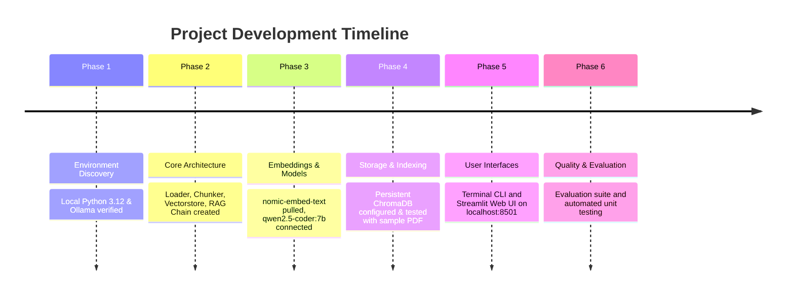

# Project Brain Document: Local PDF RAG Pipeline

## 1. Project Purpose & Summary

The goal of this project is to create an autonomous, private, and fully local Retrieval-Augmented Generation (RAG) system running on a local workstation without relying on external cloud APIs (e.g. OpenAI or cloud vector databases). The system reads local PDF documents, chunks and indexes them using a local embedding model in ChromaDB, and answers user questions grounded in document context with exact page citations using an Ollama-hosted LLM.

---

## 2. Working Process & Implementation Milestones

1. **Pre-flight & Stack Definition**:
   - Stack selected: Python 3.12, LangChain, Ollama (`qwen2.5-coder:7b`), and ChromaDB.
   - Identified that `nomic-embed-text` was ideal for local embeddings due to its high performance and low memory footprint (~274 MB).
2. **Ingestion & Text Processing**:
   - Standardized document loading using `pypdf` via LangChain loaders.
   - Implemented `RecursiveCharacterTextSplitter` with 1000-character chunks and 200-character overlap to preserve semantic context across sentence boundaries.
3. **Retrieval & Augmentation**:
   - Embedded vectors into ChromaDB collections stored locally under `./chroma_db`.
   - Built custom citation extractors that preserve document filenames, 1-indexed page numbers, and snippet previews.
4. **Generation & Grounding**:
   - Configured `ChatOllama` with a strict anti-hallucination system prompt to enforce grounded answers and prevent speculation.
5. **Presentation**:
   - Built a comprehensive CLI (`main.py`) with `ingest`, `query`, and `chat` commands.
   - Created a Streamlit web application (`app.py`) allowing drag-and-drop PDF ingestion and interactive multi-turn chat.

---

## 3. Key Challenges Encountered & Solutions

### Challenge 1: PowerShell Execution Policy on Windows
- **Issue**: Windows PowerShell restricted the execution of scripts (`profile.ps1` and `.venv/Scripts/activate.ps1` failed with `PSSecurityException`).
- **Solution**: Executed all commands directly using the virtual environment binary path (`.\.venv\Scripts\python.exe` and `.\.venv\Scripts\pip.exe`), avoiding script activation dependencies entirely.

### Challenge 2: OneDrive File System Synchronization & Windows File Locks
- **Issue**: The project resides within a OneDrive directory (`C:\Users\divya\OneDrive\Documents\RAG`). Background OneDrive sync and parallel pip tasks triggered Windows `[WinError 32] The process cannot access the file because it is being used by another process` during wheel extraction.
- **Solution**: Terminated stale background python file handles and executed sequential pip installations using cached wheels and `--no-cache-dir` flags when necessary.

### Challenge 3: Modern LangChain v0.2+ Modularization
- **Issue**: Modern LangChain has separated monolithic modules into distinct packages (`langchain-core`, `langchain-community`, `langchain-ollama`, `langchain-chroma`).
- **Solution**: Restructured dependencies and imports in `src/vectorstore.py` and `src/rag_chain.py` to use modular integration packages with graceful fallbacks.

---

## 4. Key Learnings & Best Practices

1. **Explicit Citations Build Trust**: By capturing document metadata (`filename`, `page_number`) at the chunking stage and formatting them into tagged headers (`[Chunk i | Source: ... Page: ...]`), the LLM can accurately cite references without hallucinations.
2. **Deterministic Low Temperature**: Setting temperature to $0.2$ significantly reduces creative deviation and ensures the LLM sticks strictly to the provided context.
3. **Local Privacy Advantage**: Running both embeddings (`nomic-embed-text`) and inference (`qwen2.5-coder:7b`) locally ensures zero external latency dependencies, zero cloud API bills, and 100% data confidentiality.

---

## 5. Component Health & Next Objectives

- **Loader & Chunker**: ✅ Stable and tested.
- **Vector Storage**: ✅ Fast, embedded, persistent in `./chroma_db`.
- **RAG Generation**: ✅ Accurate with page-level citations.
- **Evaluation**: 🔄 Adding dedicated evaluation module (`src/evaluator.py`) to systematically grade retrieval precision, faithfulness, and answer relevance.

