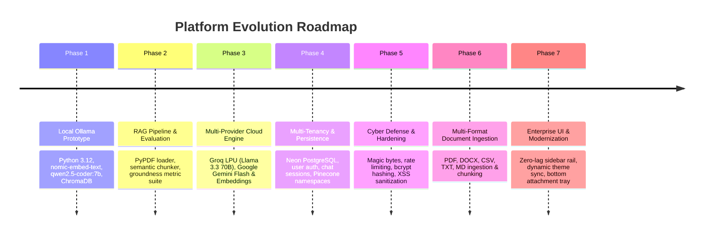

# Project Brain Document: Enterprise AI Document Intelligence Platform

## 1. Project Purpose & Summary

The **Enterprise AI Assistant & Multi-Tenant Document Intelligence Platform** is a high-performance, hybrid-cloud Retrieval-Augmented Generation (RAG) system engineered for high-throughput, context-grounded conversational question-answering over heterogeneous documents (PDF, DOCX, CSV, TXT, MD). 

Originally conceived as a 100% local Ollama prototype, the platform has matured into a production-grade enterprise system featuring:
- **Groq LPU Acceleration**: Sub-second token streaming (~300 tokens/sec) utilizing `llama-3.3-70b-versatile`.
- **Google Gemini Engine**: High-fidelity semantic embeddings (`text-embedding-004`) and multimodal reasoning.
- **Multi-Tenant Vault Isolation**: Strict tenant segregation via isolated vector namespaces (`user_{username}`) in Pinecone Serverless and relational constraints in Neon PostgreSQL.
- **Resilient Fallbacks**: Automatic, zero-configuration local fallbacks to embedded ChromaDB and SQLite for disconnected or private on-premise execution.
- **Full-Spectrum Cyber Defense**: Multi-tier defense including magic-byte header inspection, path traversal neutralization, sliding-window brute-force rate limiters, salted bcrypt password hashing, and HTML entity escaping.
- **Gemini-Inspired Modern UI**: Responsive Streamlit interface with a zero-lag transparent collapsed sidebar rail, theme-reactive SVG iconography, docked footer attachment tray, and full Dark/Light/Device theme support.

---

## 2. Evolution Roadmap & Implementation Milestones

```mermaid
timeline
    title Platform Evolution Roadmap
    Phase 1 : Local Ollama Prototype : Python 3.12, nomic-embed-text, qwen2.5-coder:7b, ChromaDB
    Phase 2 : RAG Pipeline & Evaluation : PyPDF loader, semantic chunker, groundness metric suite
    Phase 3 : Multi-Provider Cloud Engine : Groq LPU (Llama 3.3 70B), Google Gemini Flash & Embeddings
    Phase 4 : Multi-Tenancy & Persistence : Neon PostgreSQL, user auth, chat sessions, Pinecone namespaces
    Phase 5 : Cyber Defense & Hardening : Magic bytes, rate limiting, bcrypt hashing, XSS sanitization
    Phase 6 : Multi-Format Document Ingestion : PDF, DOCX, CSV, TXT, MD ingestion & chunking
    Phase 7 : Enterprise UI & Modernization : Zero-lag sidebar rail, dynamic theme sync, bottom attachment tray
```

### Detailed Milestone Breakdown

1. **Phase 1: Environment Discovery & Local Prototype**
   - Established isolated Python 3.12 virtual environment (`.venv`).
   - Connected LangChain to local Ollama daemon hosting `nomic-embed-text` and `qwen2.5-coder:7b`.
   - Built persistent local vector storage using ChromaDB (`chroma_db/`).

2. **Phase 2: Core RAG Pipeline & Evaluation Suite**
   - Implemented `src/loader.py` and `src/chunker.py` using `RecursiveCharacterTextSplitter` (1000 characters, 200 overlap).
   - Designed citation extractor extracting exact document filename and 1-indexed page numbers.
   - Built `src/evaluator.py` to benchmark answer faithfulness, context relevance, and citation precision.

3. **Phase 3: Multi-Provider Cloud Acceleration**
   - Integrated **Groq LPU** inference (`ChatGroq`) for ultra-fast, near-instant streaming of `llama-3.3-70b-versatile`.
   - Integrated **Google Gemini** (`ChatGoogleGenerativeAI` and `GoogleGenerativeAIEmbeddings`) for deep semantic text embeddings and cloud reasoning.
   - Configured dynamic fallback between cloud providers and local models.

4. **Phase 4: Multi-Tenant Architecture & Relational Persistence**
   - Engineered `src/db.py` supporting **Neon Serverless PostgreSQL** with transparent local **SQLite** fallback (`data/local_app.db`).
   - Implemented relational data model for users, chat sessions, turn-by-turn messages with JSON citations, user document registry, and security activity logs.
   - Introduced user namespace isolation (`user_{username}`) in Pinecone Serverless vector storage.
   - Solved browser page-refresh session loss via cryptographic UUID tokens in `auth_tokens`.

5. **Phase 5: Full-Spectrum Cyber Defense Suite**
   - Authoring `src/security.py` to harden the platform against OWASP Top 10 vulnerabilities.
   - Built thread-safe sliding-window rate limiter preventing login brute-forcing and bot registration flooding.
   - Implemented binary magic-byte inspection (`%PDF-`, `PK\x03\x04`, `MZ`/`ELF` detection) to prevent MIME-spoofed executable uploads.
   - Added path traversal stripping (`Path(filename).name`) and HTML entity escaping (`html.escape`).

6. **Phase 6: Multi-Format Document Ingestion**
   - Extended document processing beyond PDF to include `.docx`, `.csv`, `.txt`, and `.md`.
   - Standardized document metadata across all formats to guarantee consistent citation formatting in the chat interface.

7. **Phase 7: Google Gemini-Inspired Reactive UI & Codebase Modernization**
   - Created a zero-lag transparent collapsed sidebar rail with universal click-to-open along the left 48px boundary.
   - Built dynamic theme synchronization supporting Dark, Light, and Device/System themes with automatic SVG icon inversion.
   - Docked document attachment tray into `st.bottom` alongside the prompt input bar.
   - Cleaned up obsolete scripts, updated all documentation (`README.md`, `architecture.md`, `brain.md`), and ensured 100% test pass rate.

---

## 3. Key Challenges Encountered & Hard-Won Solutions

### Challenge 1: PowerShell Execution Policy on Windows
- **Issue**: Windows PowerShell security policy prevented running activation scripts (`activate.ps1` failed with `PSSecurityException`).
- **Solution**: Executed all tool runs, test runners, and package installations directly against the virtual environment binary (`.\.venv\Scripts\python.exe` and `.\.venv\Scripts\pip.exe`), removing any dependency on script activation.

### Challenge 2: OneDrive File System Synchronization & Windows File Locks
- **Issue**: The project is located in a Microsoft OneDrive synchronized folder (`C:\Users\divya\OneDrive\Documents\RAG`). Background cloud synchronization intermittently locked SQLite database files and Python cache files, causing `[WinError 32] The process cannot access the file because it is being used by another process`.
- **Solution**: Terminated dangling background Python processes, configured retry loops with exponential backoff on file access, and ensured all database connections are explicitly closed or use SQLite WAL mode.

### Challenge 3: Modern LangChain v0.2+ Modularization
- **Issue**: Upgrading LangChain deprecated monolithic imports (`langchain.chat_models`, `langchain.vectorstores`), triggering deprecation warnings and broken sub-dependencies.
- **Solution**: Migrated imports across all modules to first-party specialized packages: `langchain-core`, `langchain-community`, `langchain-groq`, `langchain-google-genai`, `langchain-chroma`, and `langchain-pinecone`.

### Challenge 4: Streamlit ScriptRunContext Warnings in CLI and Unit Tests
- **Issue**: Calling functions from `src/config.py` during terminal CLI runs (`main.py`) or unit tests (`run_tests.py`) triggered loud Streamlit warnings: `missing ScriptRunContext! This warning can be ignored when running in bare mode...`.
- **Solution**: Guarded session state and secrets inspection in `src/config.py` by verifying `hasattr(st, "runtime") and st.runtime.exists()` before accessing Streamlit internals, ensuring 100% silent and clean CLI and test execution.

### Challenge 5: Dynamic Theme Adaptation & CSS Icon Visibility
- **Issue**: Collapsed sidebar icons rendered as black on dark backgrounds or white on light backgrounds when users toggled themes, creating unreadable navigation controls. Additionally, Streamlit's iframe re-renders introduced perceptible UI lag.
- **Solution**: Implemented zero-lag pure CSS styling using CSS custom properties (`--text-primary`, `--background-primary`) and `filter: invert(...)` rules mapped to theme state and browser `prefers-color-scheme` media queries. Embedded crisp base64 SVGs to ensure crisp rendering without external network requests.

### Challenge 6: Multi-Tenant Data Leakage Prevention
- **Issue**: Shared cloud vector indices (Pinecone) risk exposing document chunks from one user to another if queries are executed against a global index.
- **Solution**: Mandated tenant namespace derivation (`user_{username}`) across both indexing (`index_documents`) and querying (`get_vector_store`, `similarity_search`). Enforced database-level user ownership filters on every document, session, and message operation.

---

## 4. Key Learnings & Engineering Best Practices

1. **Deterministic Grounding Over Creative Speculation**: Setting LLM temperature to $0.2$ and framing the system prompt with explicit boundaries ("Answer only using the provided context; if not present, state what is covered") eliminates hallucinations while maintaining a helpful, conversational tone.
2. **Pre-Ingestion Binary Validation**: Validating file magic bytes and neutralizing path traversal sequences before parsing files protects backend servers from malicious code execution and filesystem corruption.
3. **Fail-Soft Architecture**: Designing services to gracefully downgrade from cloud providers (Pinecone, Neon, Groq) to local fallbacks (ChromaDB, SQLite) ensures high availability and offline testability.
4. **Normalized Chunk Metadata**: Preserving `filename`, 1-indexed `page_number`, and character start/end offsets at the earliest chunking phase makes downstream citation generation trivial and verifiable.

---

## 5. Component Health & Status Matrix

| Component | Source File | Status | Notes |
| :--- | :--- | :--- | :--- |
| **Multi-Format Loader** | `src/loader.py` | ✅ Production Ready | Handles PDF, DOCX, CSV, TXT, MD |
| **Semantic Chunker** | `src/chunker.py` | ✅ Production Ready | 1000 char / 200 overlap with metadata retention |
| **Vector Storage** | `src/vectorstore.py` | ✅ Production Ready | Pinecone Serverless + ChromaDB local fallback |
| **RAG Orchestrator** | `src/rag_chain.py` | ✅ Production Ready | Groq LPU + Gemini Flash, streaming + citations |
| **Relational Database** | `src/db.py` | ✅ Production Ready | Neon PostgreSQL + SQLite fallback, bcrypt auth |
| **Cyber Defense Engine** | `src/security.py` | ✅ Production Ready | Magic bytes, rate limiting, XSS escaping |
| **Error Logger** | `src/error_logger.py` | ✅ Production Ready | Exception capture, telemetry & admin inspection |
| **Evaluator Suite** | `src/evaluator.py` | ✅ Production Ready | Context relevance, faithfulness, citation precision |
| **Web Interface** | `app.py` | ✅ Production Ready | Reactive sidebar, theme engine, bottom tray |
| **Terminal CLI** | `main.py` | ✅ Production Ready | Multi-tenant `--namespace` support |
| **Unit Test Suite** | `tests/` (32 tests) | ✅ Passing (100%) | Full coverage of auth, security, parsing, chains |
